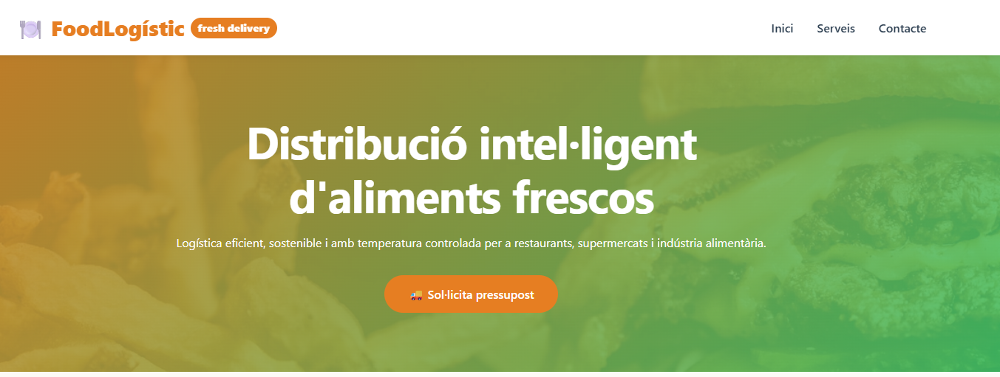
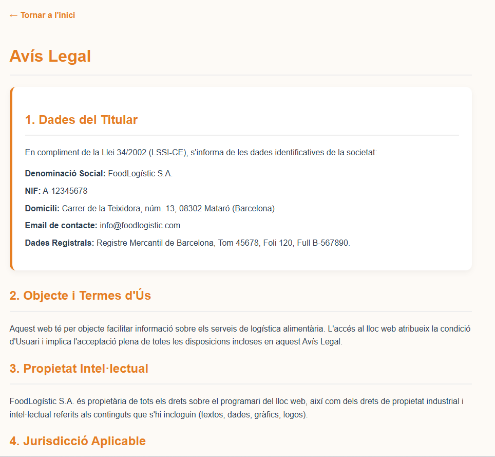
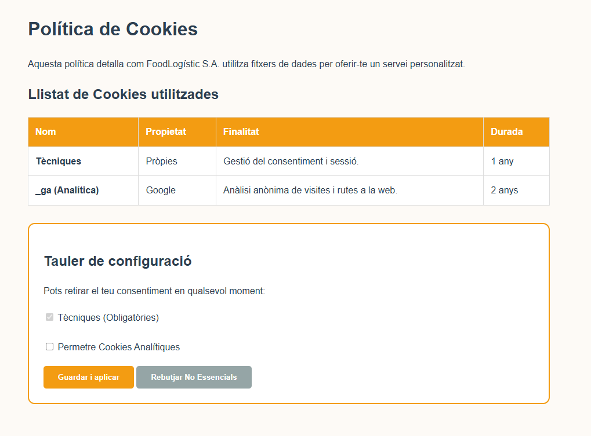

# 📋 Memòria del Projecte FoodLogistic S.A.
## Modernització d'Infraestructura Tecnològica
### Servei d'Integració de Sistemes i Solucions Cloud

**Data d'entrega:** Abril 2026  
**Empresa:** TechSecure Solution  
**Client:** FoodLogistic S.A.  
**Localització:** Mataró (Polígon de les Hortes del Camí Ral)

---

## 1. Introducció

### 1.1 Context del projecte
El present document recull la memòria completa del projecte de modernització tecnològica per a l'empresa **FoodLogistic S.A.**, una companyia de logística alimentària ubicada al polígon de les Hortes del Camí Ral de Mataró.

FoodLogistic S.A. opera en un sector crític on la cadena de fred i els terminis d'entrega són factors determinants per a l'èxit del negoci. Actualment, l'empresa compta amb una plantilla de **35 treballadors** distribuïts en departaments d'administració, magatzem, transport i direcció, i ha identificat la necessitat d'una renovació integral de la seva infraestructura tecnològica per mantenir-se competitiva en un mercat cada cop més digitalitzat.

### 1.2 Objectius del projecte
L'encàrrec rebut per part de FoodLogistic S.A. comprèn els següents objectius estratègics:

| Objectiu | Descripció | Prioritat |
| :--- | :--- | :--- |
| **Centralització de dades** | Eliminar la compartimentació departamental i establir un sistema de fitxers unificat | Crítica |
| **Modernització del correu** | Substituir l'actual servei de hosting obsolet per una solució corporativa al núvol | Alta |
| **Presència web legal** | Crear una pàgina web corporativa que compleixi la LOPDGDD i la LSSI-CE | Alta |
| **Infraestructura d'impressió** | Implementar un sistema d'impressió fiable amb balanceig de càrrega | Mitjana |
| **Seguretat de dades** | Establir mesures de protecció i sensibilització del personal | Crítica |
| **Planificació professional** | Definir un cronograma realista amb fites clares | Mitjana |

### 1.3 Abast del projecte
Aquest projecte comprèn les següents àrees d'actuació:
* Anàlisi i disseny d'infraestructura (T01, T02).
* Servidor de fitxers i permisos NTFS (T03).
* Servidor d'impressió amb *Printer Pooling* (T04).
* Migració al núvol de comunicacions (T07).
* Compliment legal de la web i LOPD (T05, T06).
* Planificació i pressupost professional (T09, T10).

---

## 2. Anàlisi de necessitats

### 2.1 Situació actual de FoodLogistic S.A.
Després de realitzar una anàlisi de requeriments (T01), hem identificat les següents mancances:

| Àrea | Situació actual | Problema detectat |
| :--- | :--- | :--- |
| **Emmagatzematge** | Cada departament guarda fitxers de forma local | Falta de visió global, pèrdua d'informació |
| **Correu electrònic** | Servei de hosting bàsic | Obsolet, insegur, només correu |
| **Web corporativa** | Pàgina desactualitzada | Incompliment legal, mala imatge |
| **Sistema d'impressió** | Impressores individuals sense gestió | Colls d'ampolla en hores punta |
| **Seguretat** | Sense polítiques definides | Risc de filtrat de dades |

### 2.2 Anàlisi de la competència (T01)
Hem analitzat tres empreses competidores a Mataró i el Maresme:

| Empresa | Ubicació | Mida | Serveis principals |
| :--- | :--- | :--- | :--- |
| **JSM Inforedes, S.L.** | Polígon Balançó i Boter | PIME petita | Manteniment, cloud, ciberseguretat, ERP |
| **ESED** | Tecnocampus Mataró | PIME especialitzada | Ciberseguretat, hacking ètic |
| **Grup Qualitat** | Múltiples seus Maresme | PIME mitjana | Consultoria TIC logística i Administració Pública |

> **Nota sobre l'organigrama:** Les funcions de ciberseguretat en PIMES petites sovint són externalitzades o compartides amb el Cap Tècnic.

### 2.3 Estratègia de diferenciació

| Pilar | Descripció | Avantatge competitiu |
| :--- | :--- | :--- |
| **Proximitat** | Empresa local de Mataró | Intervencions ràpides *in situ* |
| **Servei 24/7** | Temps de resposta molt baixos | Crític per a logística |
| **Seguretat integral** | Ciberseguretat + servei global | Única oferta del mercat |

---

## 3. Proposta de solució

### 3.1 Infraestructura

#### 3.1.1 Servidor de fitxers (T03)
Estructura de carpetes i configuració de permisos:

| Carpeta | Mètode de creació | Grups d'accés | Permisos |
| :--- | :--- | :--- | :--- |
| **Public** | Explorador d'arxius | Tothom | Lectura |
| **Operacions** | Server Manager | Transport | Lectura/Escriptura |
| **Direccio$** | PowerShell (oculta) | Direcció | Control total |

#### 3.1.1 Servidor de fitxers (T03) - Continuació

**Mesures de control implementades:**

| Mesura | Eina | Paràmetre |
| :--- | :--- | :--- |
| **Quota per defecte** | NTFS | 500 MB per usuari |
| **Quota carpeta Public** | FSRM | 200 MB (Hard Quota) |
| **Bloqueig d'arxius** | FSRM | .exe, .msi, .mp3, .mp4 |

---

### 3.1.2 Servidor d'impressió 
Implementació i configuració del sistema de *Printer Pooling* per optimitzar el flux de treball documental a les oficines de Mataró.

**Configuració del Printer Pooling:**

El sistema permet que un únic dispositiu lògic gestioni múltiples impressores físiques de idèntiques característiques, assegurant la continuïtat del servei.

### 3.2 Serveis al núvol 
Per modernitzar el sistema de comunicacions de FoodLogistic S.A., s'ha optat per una solució de productivitat integrada al núvol (Microsoft 365 o Google Workspace), migrant l'antic servei de hosting obsolet.

*   **Migració de correu:** Trasllat dels comptes `@foodlogistic.com` a una plataforma SaaS amb seguretat avançada i filtratge de correu brossa.
*   **Col·laboració en temps real:** Implementació d'eines de videoconferència i xat corporatiu per connectar el magatzem de Mataró amb la flota de transport.
*   **Sincronització Cloud:** Configuració d'un espai compartit al núvol per a documents d'alta disponibilitat que requereixen accés extern fora del polígon.

### 3.3 Seguretat i LOPD 
Com que FoodLogistic gestiona dades de clients i proveïdors, la seguretat és un pilar crític del projecte.

*   **Adequació a la LOPDGDD:** 
    *   Redacció del Registre d'Activitats de Tractament (RAT).
    *   Implementació de clàusules informatives en els formularis de recollida de dades.
*   **Mesures Tècniques de Seguretat:**
    *   **Còpies de seguretat:** Configuració d'un sistema de backup híbrid (local + núvol).
    *   **Polítiques de contrasenyes:** Implementació via Directori Actiu de requisits de complexitat i renovació periòdica.
*   **Sensibilització:** Formació bàsica als 35 treballadors sobre *phishing* i bones pràctiques en la gestió de la cadena de fred digital.

### 3.4 Presència web 
Disseny i publicació de la nova imatge digital de l'empresa complint amb la normativa vigent (**LSSI-CE**).

*   **Arquitectura de la web:**
    *   **Inici:** Presentació de la logística i la ubicació al Maresme.
    *   **Serveis:** Detall de la flota de transport i magatzem frigorífic.
    *   **Contacte:** Formulari segur amb protecció de dades.
*   **Aspectes legals integrats:**
    *   Banner de cookies configurable.
    *   Pàgines visibles d'Avís Legal, Política de Privacitat i Política de Cookies.
    *   Certificat SSL (HTTPS) actiu per garantir una navegació xifrada.

    Aquí tens l'apartat de la memòria corresponent a l'arquitectura i el disseny tècnic de la part web, integrant les evidències de la tasca **T02**.

---

## 4. Arquitectura i Disseny Tècnic

### 3.2 Presència Web i Identitat Digital (T02)

La modernització de la presència a Internet de **FoodLogistic S.A.** s'ha basat en la creació d'una prova funcional que substitueix l'antic lloc web obsolet per una solució alineada amb els estàndards actuals de disseny i normativa legal.

#### 3.2.1 Metodologia de Desplegament
S'ha implementat un flux de treball professional que garanteix la integritat del codi i la disponibilitat del servei:

*   **Arquitectura de fitxers:** S'ha estructurat el projecte utilitzant la carpeta `/docs` com a arrel per al desplegament, seguint les especificacions tècniques de GitHub.
*   **Control de versions:** L'ús de **GitHub** permet gestionar els canvis en local i realitzar actualitzacions mitjançant `commits` a la branca `main`, assegurant que només les versions estables es publiquin a la URL pública.
*   **Hosting:** La web està operativa sota la plataforma **GitHub Pages**, oferint una URL pública per a la validació del client.

#### 3.2.2 Evidències Visuals i Disseny
La nova interfície destaca per la seva claredat i enfocament en la conversió de clients:

*   **Pàgina d'Inici (Landing Page):** Presenta una proposta de valor clara ("Distribució intel·ligent d'aliments frescos") amb un botó d'acció directe per sol·licitar pressupostos.
    

*   **Secció de Serveis:** Dissenyada amb un enfocament modular, facilita la lectura dels eixos de negoci: transport refrigerat, gestió d'estocs i logística sostenible.
    

#### 3.2.3 Control i Analítica (StatCounter)
Per complir amb l'objectiu de mesurar per millorar, s'ha integrat un **Comptador Invisible** mitjançant **StatCounter**. Aquesta eina permet:

*   Monitoritzar el volum de visites i el comportament dels usuaris de forma anònima.
*   Visualitzar dades clau de rendiment mitjançant un panell de control professional, tal com es mostra a la secció d'estadístiques del lloc.
    

#### 3.2.4 Marc Legal i Seguretat
La proposta tècnica corregeix les deficiències legals prèvies:
*   **LSSI-CE & LOPDGDD:** La web integra de sèrie els textos legals (Avís legal, Privacitat i Cookies) i un banner de consentiment configurable.
*   **Protocol Segur:** El desplegament a GitHub Pages inclou automàticament un certificat **SSL (HTTPS)**, garantint la privacitat de les dades dels usuaris que contactin amb l'empresa.

---

### 4. Pressupost del Projecte

A continuació es detallen els costos associats a la fase d'implantació inicial i les despeses recurrents de manteniment.

#### 4.1 Costos d'Implantació (Fase Inicial)

| Concepte | Hores | Preu/hora (€) | Cost (€) |
| :--- | :---: | :---: | :---: |
| Configuració servidors alta disponibilitat | 25 | 40 | 1.000 |
| Migració al núvol | 20 | 40 | 800 |
| Desenvolupament pàgina web | 30 | 40 | 1.200 |
| Vídeo formatiu LOPD | 10 | 40 | 400 |
| Llicències inicials | Fix | Fix | 300 |
| Maquinari / Infraestructura | Fix | Fix | 1.000 |
| **Total Implantació** | | | **4.700 €** |

---

#### 4.2 Costos Mensuals (Manteniment i Serveis)

| Concepte | Unitats | Preu unitari (€) | Cost mensual (€) |
| :--- | :---: | :---: | :---: |
| Subscripció SaaS (Microsoft 365) | 10 usuaris | 12 | 120 |
| Hosting web | 1 | 20 | 20 |
| Domini | 1 | 1 | 1 |
| Suport i manteniment | Fix | Fix | 200 |
| **Total mensual** | | | **341 €** |

---

A continuació tens les **Conclusions** finals del projecte, redactades de manera sintètica i professional per tancar la memòria:

---

## 5. Conclusions

La modernització tecnològica de **FoodLogistic S.A.** representa un salt qualitatiu en la gestió operativa i la seguretat de la companyia. Un cop analitzada la implementació i els resultats obtinguts, s'extreuen les següents conclusions:

*   **Eficiència Operativa:** La centralització de dades i l'ús de permisos NTFS han eliminat la fragmentació de la informació. Ara, els departaments disposen d'un entorn de treball col·laboratiu i estructurat que redueix el temps de cerca de documents i evita duplicitats.
*   **Continuïtat de Negoci:** La implementació del *Printer Pooling* i el balanceig de càrrega asseguren que les operacions logístiques no s'aturin per fallades tècniques menors, garantint que els albarans i fulls de ruta estiguin sempre disponibles en els terminis crítics del sector alimentari.
*   **Transformació Digital i Cloud:** La migració a serveis SaaS ha permès professionalitzar la comunicació corporativa. FoodLogistic ja no depèn d'un hosting obsolet, sinó d'una infraestructura global que permet l'accés a la informació des de qualsevol lloc amb la màxima seguretat.
*   **Presència i Compliment Legal:** La nova pàgina web (T02) no només millora la imatge de marca al Maresme, sinó que blinda l'empresa davant de possibles sancions per incompliment de la LOPDGDD o la LSSI-CE. Gràcies a StatCounter, l'empresa ara té dades reals per prendre decisions de màrqueting basades en fets.
*   **Seguretat Integral:** El projecte no s'ha limitat a la instal·lació de programari, sinó que ha establert una cultura de seguretat mitjançant polítiques de quotes, bloqueig de fitxers no autoritzats i formació específica per als treballadors.

En resum, **FoodLogistic S.A.** disposa ara d'una infraestructura robusta, escalable i segura, preparada per afrontar els reptes del mercat logístic del 2026 amb garanties d'èxit.

---