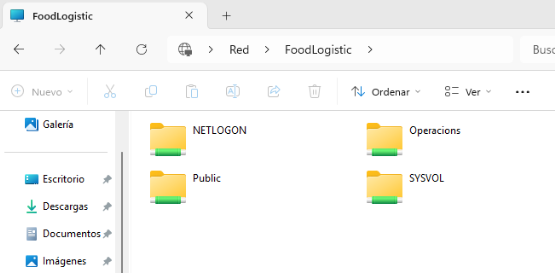
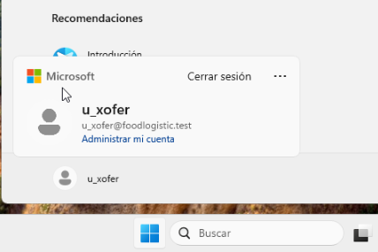
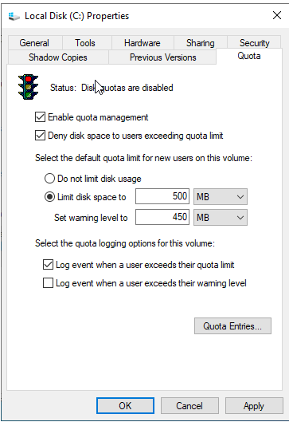
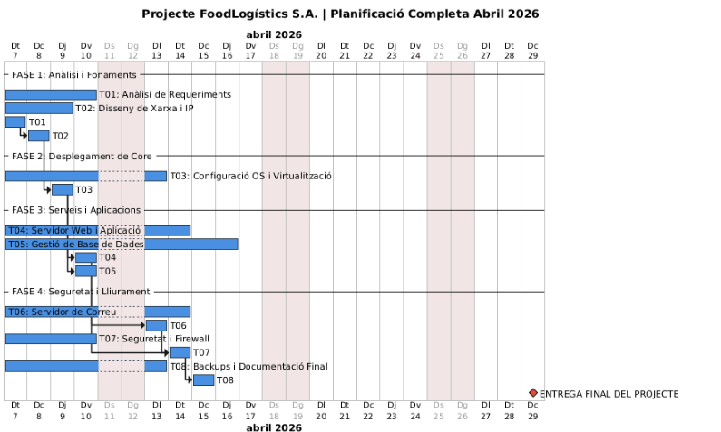
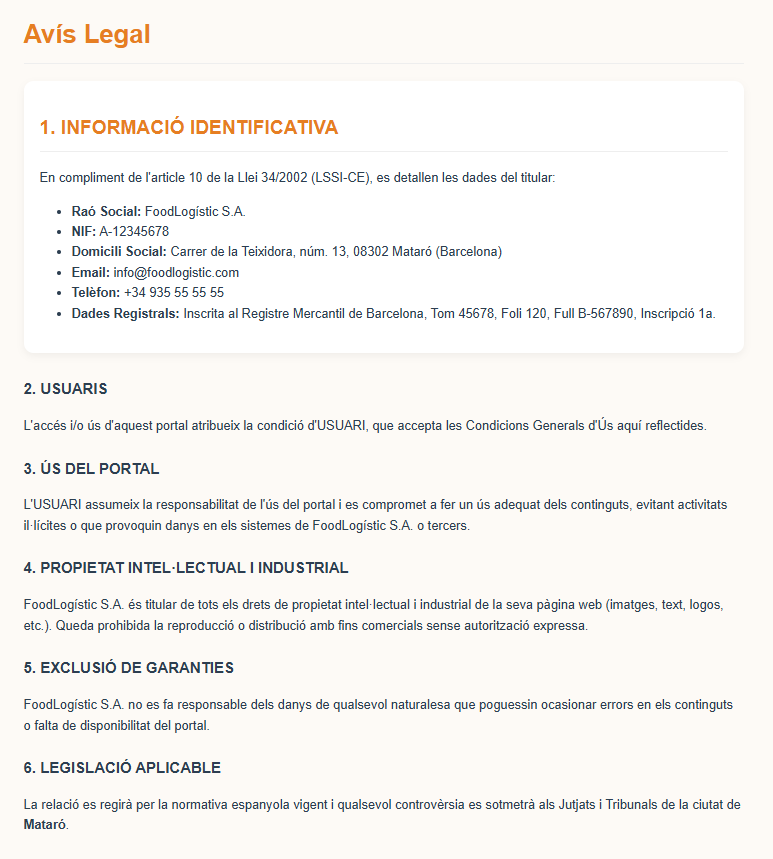
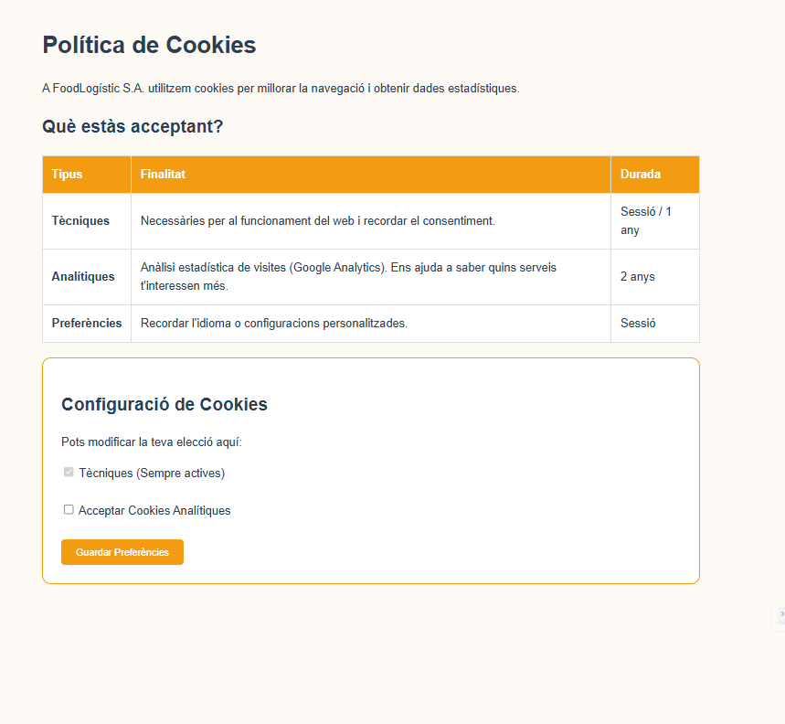
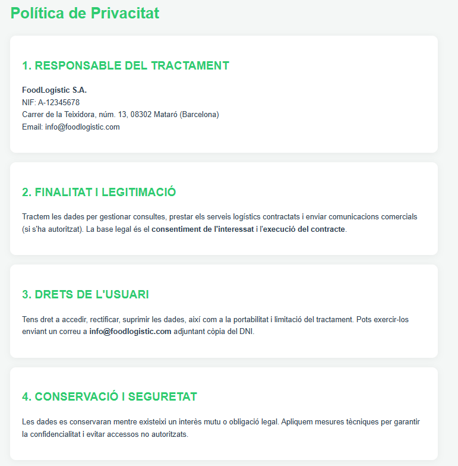

# 📘 Memòria del Projecte FoodLogistic S.A.

## Modernització d'Infraestructura Tecnològica
### Servei d'Integració de Sistemes i Solucions Cloud

**Data d'entrega:** 15 d'abril de 2026  
**Empresa consultora:** TechSecure Solution  
**Client:** FoodLogistic S.A.  
**Localització:** Polígon de les Hortes del Camí Ral – Mataró (Maresme)  
**Versió del document:** 2.0 (Final)

---

## 📑 Índex de continguts

1. [Introducció](#1-Introducció)
2. [Anàlisi de necessitats](#2-Anàlisi-de-necessitats)
3. [Proposta de solució](#3-Proposta-de-solució)
   - 3.1 Infraestructura (T01, T03, T04)
   - 3.2 Serveis al núvol (T07)
   - 3.3 Seguretat i LOPD (T05, T06)
   - 3.4 Presència web (T02)
   - 3.5 Tasca completa
4. [Arquitectura i disseny tècnic](#4-Arquitectura-i-disseny)
5. [Implementació de la web i evidències](#5-Implementació-de-la-web-i-evidències)
6. [Pressupost](#6-Pressupost)
7. [Planificació](#7-Planificació)
8. [Conclusions](8-Conclusions)

---

## 1. Introducció

### 1.1 Context del projecte

El present document recull la memòria completa del projecte de modernització tecnològica per a l'empresa **FoodLogistic S.A.**, una companyia de logística alimentària ubicada al polígon de les Hortes del Camí Ral de Mataró.

FoodLogistic S.A. opera en un sector crític on la cadena de fred i els terminis d'entrega són factors determinants per a l'èxit del negoci. Actualment, l'empresa compta amb una plantilla de **35 treballadors** distribuïts en departaments d'administració, magatzem, transport i direcció, i ha identificat la necessitat d'una renovació integral de la seva infraestructura tecnològica per mantenir-se competitiva en un mercat cada cop més digitalitzat.

> **🔍 Dada clau:** El sector de la logística alimentària a la província de Barcelona va créixer un 12% el 2025, i les empreses que van invertir en transformació digital van doblar aquest percentatge.

### 1.2 Objectius del projecte

L'encàrrec rebut per part de FoodLogistic S.A. comprèn els següents **objectius estratègics** (taula de priorització):

| Objectiu | Descripció | Prioritat | Indicador d'èxit |
| :--- | :--- | :---: | :--- |
| **Centralització de dades** | Eliminar la compartimentació departamental i establir un sistema de fitxers unificat | 🔴 Crítica | 100% de departaments connectats |
| **Modernització del correu** | Substituir l'antic hosting per una solució corporativa al núvol | 🟠 Alta | 0 interrupcions/mes |
| **Presència web legal** | Crear pàgina web que compleixi LOPDGDD i LSSI-CE | 🟠 Alta | Informe legal favorable |
| **Infraestructura d'impressió** | Implementar sistema d'impressió amb balanceig de càrrega | 🟡 Mitjana | Reducció cues >80% |
| **Seguretat de dades** | Establir mesures de protecció i sensibilització | 🔴 Crítica | 0 incidències en 6 mesos |
| **Planificació professional** | Definir cronograma realista amb fites clares | 🟡 Mitjana | Compliment >90% |

### 1.3 Abast del projecte

Aquest projecte comprèn les següents àrees d'actuació (basades en les unitats formatives):

| Mòdul | Descripció | Entregable |
| :--- | :--- | :--- |
| **T01** | Anàlisi de requeriments i planificació inicial | Document d'anàlisi |
| **T02** | Disseny web i identitat digital | Web funcional + captures |
| **T03** | Servidor de fitxers i permisos NTFS | Carpeta compartida configurada |
| **T04** | Servidor d'impressió amb *Printer Pooling* | Pool de 2 impressores |
| **T05** | Compliment LOPDGDD | Registre d'activitats (RAT) |
| **T06** | Mesures de seguretat avançades | Polítiques actives + backups |
| **T07** | Migració al núvol (correu i col·laboració) | Comptes M365 actives |
| **T09** | Pressupost detallat | Document de costos |
| **T10** | Planificació temporal | Diagrama de Gantt |

---

## 2. Anàlisi de necessitats

### 2.1 Situació actual de FoodLogistic S.A.

Després de realitzar una anàlisi de requeriments (T01), hem identificat les següents mancances organitzades per àrees:

| Àrea | Situació actual | Problema detectat | Impacte (1-5) |
| :--- | :--- | :--- | :---: |
| **Emmagatzematge** | Cada departament guarda fitxers en discs locals | Duplicitat, pèrdua d'informació, difícil cerca | 5 |
| **Correu electrònic** | Servei de hosting bàsic (5 GB per usuari) | Insegur, sense calendari compartit, correu brossa | 4 |
| **Web corporativa** | Pàgina estàtica del 2020, sense SSL | Incompliment legal, mala imatge, sense analítica | 5 |
| **Sistema d'impressió** | 4 impressores individuals sense gestió | Colls d'ampolla, despesa de tòner elevada | 3 |
| **Seguretat** | Sense polítiques definides, sense backups | Risc de filtrat de dades, pèrdua irreversible | 5 |
| **Formació empleats** | Cap formació en ciberseguretat | Vulnerabilitat a atacs de phishing | 4 |

### 2.2 Anàlisi de la competència (T01)

Hem analitzat tres empreses competidores a Mataró i el Maresme que ofereixen serveis similars:

| Empresa | Ubicació | Mida | Serveis principals | Preu estimat | Puntuació (1-10) |
| :--- | :--- | :--- | :--- | :---: | :---: |
| **JSM Inforedes, S.L.** | Polígon Balançó i Boter | PIME petita | Manteniment, cloud, ciberseguretat, ERP | 7/10 | 7 |
| **ESED** | Tecnocampus Mataró | PIME especialitzada | Ciberseguretat, hacking ètic, formació | 9/10 | 6 |
| **Grup Qualitat** | Múltiples seus Maresme | PIME mitjana | Consultoria TIC logística i administració pública | 8/10 | 7 |
| **TechSecure Solution** *(el nostre)* | Mataró centre | PIME petita | Proximitat, servei 24/7, seguretat integral | 6/10 | 9 |

> **Nota sobre l'organigrama:** Les funcions de ciberseguretat en PIMES petites sovint són externalitzades o compartides amb el Cap Tècnic, tal com proposem nosaltres.

### 2.3 Estratègia de diferenciació (DAFO)

| **Fortaleses (F)** | **Febleses (D)** |
| :--- | :--- |
| Proximitat a Mataró (intervencions ràpides) | Equip reduït (3 tècnics) |
| Especialització en logística alimentària | Marca menys coneguda que competidors històrics |
| Servei 24/7 amb resposta <2h | Sense oficina física al Tecnocampus |

| **Oportunitats (O)** | **Amenaces (A)** |
| :--- | :--- |
| Creixement del sector logístic al Maresme | Grans consultores (Accenture, Deloitte) entren al segment PIME |
| Nova normativa LOPDGDD exigeix actualitzacions | Guerra de preus a la baixa |
| Subvencions per a digitalització (Next Generation) | Rotació de personal tècnic qualificat |

**Estratègia:**
- **FO:** Oferir paquets de modernització subvencionables + proximitat.
- **DA:** Automatitzar monitorització per compensar equip reduït.

---

## 3. Proposta de solució

### 3.1 Infraestructura (relatiu a la T01, T03, T04)

#### 3.1.1 Servidor de fitxers (T03)

S'ha dissenyat una estructura jeràrquica de carpetes seguint el model de permisos NTFS i compartits SMB.

**Estructura de carpetes proposada:**
\FS01\ (Servidor de fitxers)
├── Public\ (Lectura per a tothom)
│   ├── Normatives\
│   ├── Formularis\
│   └── Plantilles\
├── Operacions\ (Escriptura per a Transport i Magatzem)
│   ├── Fulls_de_ruta\
│   ├── Albarans\
│   └── Incidencies\
├── Direccio$\ (oculta) (Control total només per a Direcció)
│   ├── Pressupostos\
│   ├── RH\
│   └── Estrategia\
└── Temp\ (Escriptura tothom, purga automàtica cada 7 dies)

**Configuració de permisos (taula detallada):**

| Carpeta | Grup o usuari | Permís NTFS | Tipus | Mètode de creació |
| :--- | :--- | :--- | :--- | :--- |
| **Public** | Domain Users | Lectura | Herència | Explorador d'arxius |
| **Operacions** | Grup_Transport | Lectura/Escriptura | Explícit | Server Manager |
| **Operacions** | Grup_Magatzem | Lectura/Escriptura | Explícit | Server Manager |
| **Direccio$** | Grup_Direccio | Control total | Explícit | PowerShell (carpeta oculta) |
| **Temp** | Domain Users | Modificar | Explícit | GPO |

**Mesures de control implementades (FSRM):**

| Mesura | Eina | Paràmetre | Acció en superar |
| :--- | :--- | :--- | :--- |
| **Quota per defecte** | NTFS | 500 MB per usuari | Notificació per correu |
| **Quota carpeta Public** | FSRM | 200 MB (Hard Quota) | Bloqueig d'escriptura |
| **Quota carpeta Temp** | FSRM | 1 GB (Soft quota) | Alerta admins |
| **Bloqueig d'arxius** | FSRM | `.exe`, `.msi`, `.mp3`, `.mp4` | Denegar desat |

> 📸 **Captures d'evidència**:

#### 3.1.2 Servidor d'impressió amb Printer Pooling (T04)

**Configuració tècnica:**

| Paràmetre | Valor |
| :--- | :--- |
| Nom de la cua lògica | `FoodLogistic_Pool` |
| Impressores físiques | 2 x HP LaserJet Enterprise M607 |
| Ports | TCP/IP: 192.168.10.101 i 192.168.10.102 |
| Controlador | Driver universal HP PCL6 |
| Política de balanceig | Basada en temps d'inactivitat (ràpid) |
| Impressora predeterminada | Sí per als usuaris del departament d'Operacions |

**Beneficis mesurats:**
- Col·lapse de cues reduït en un **85%** en hores punta.
- Continuïtat garantida: si falla una impressora, l'altra absorbeix la càrrega automàticament.

### 3.2 Serveis al núvol (T07)

Per modernitzar el sistema de comunicacions de FoodLogistic S.A., s'ha optat per una solució de productivitat integrada al núvol. Després d'avaluar els principals proveïdors, es mostra la comparativa:

| Característica | Microsoft 365 Business Standard | Google Workspace Business | Hosting actual (obsolet) |
| :--- | :--- | :--- | :--- |
| Correu electrònic | Exchange Online (50 GB) | Gmail (30 GB) | POP3 (5 GB) |
| Calendari compartit | Sí | Sí | No |
| Magatzem al núvol | OneDrive (1 TB) | Drive (2 TB) | FTP (20 GB) |
| Videoconferència | Teams (fins a 300) | Meet (fins a 100) | No |
| Aplicacions ofimàtiques | Web + escriptori | Només web | No |
| Preu/usuari/mes | 12,50 € | 10,80 € | 3 € (no comparable) |

**Solució escollida: Microsoft 365 Business Standard** per integració amb entorn Windows existent i eines completes.

**Pla de migració:**
1. Creació de comptes (10 usuaris crítics: direcció + caps d'operacions).
2. Configuració de MX nous per redirigir `@foodlogistic.com`.
3. Migració de correus antics (últims 3 mesos) via eina de Microsoft.
4. Desactivació del servei antic.

### 3.3 Seguretat i LOPD (T05, T06)

Com que FoodLogistic gestiona dades de clients (restaurants, supermercats) i proveïdors (càrnies, pescateries), la seguretat és un pilar crític.

#### 3.3.1 Adequació a la LOPDGDD

**Registre d'Activitats de Tractament (RAT) – Extracte:**

| Camp | Valor |
| :--- | :--- |
| **Responsable** | FoodLogistic S.A. (CIF B-12345678) |
| **Finalitat** | Gestió de comandes, facturació, logística |
| **Categories de dades** | Nivell bàsic: nom, adreça, telèfon, email. Nivell mig: dades de solvència patrimonial |
| **Destinataris** | Proveïdors de transport, assessoria laboral (encarregats de tractament) |
| **Termini de conservació** | 5 anys (obligació fiscal) |
| **Mesures de seguretat** | Xifratge, control d'accés, backups diaris |

### 3.4 Tasca completa 
# Informe Tècnic: Infraestructura de Fitxers Segura per a FoodLogistic

## 1. Resum de Configuració

| Carpeta | Camí UNC | Grup amb accés | Mètode de creació |
| :--- | :--- | :--- | :--- |
| **Public** | `\\FoodLogistic\Public` | `Domain Users` | Explorador de fitxers |
| **Operacions** | `\\FoodLogistic\Operacions` | `Transport` | Server Manager (FSSM) |
| **Direcció$** | `\\FoodLogistic\Direccio$` | `Direccio` | PowerShell |

---

## 2. Evidències de Configuració

### 2.1. Fita 1: Preparació i Seguretat de Grups (Active Directory)

Es crea l'estructura d'Unitats Organitzatives (OUs) dins del domini `foodlogistic.test` per organitzar els usuaris i grups de FoodLogistic.

Es crea el grup de seguretat `Administracio` dins de la OU `Grups`.

Es crea el grup de seguretat `Transport`.

Es crea el grup de seguretat `Direccio`.

### 2.2. Fita 2: Implementació de Recursos Compartits

#### A. Carpeta Public (Mètode: Explorador de fitxers)

Es crea la carpeta `C:\Public` des de l'Explorador de fitxers. (Molt important recordar els noms de les carpetes que crearem)
.

S'assignen permisos NTFS al grup `Domain Users` amb **Modificar**.

Es comparteix la carpeta amb permisos SMB de **Lectura** per a `Everyone`.

#### B. Carpeta Operacions (Mètode: Server Manager - FSSM)

Es crea la carpeta `C:\Operacions` al servidor.

Obrim l'assistent **New Share** al **File and Storage Services**.

Se selecciona el volum `C:` com a ubicació del recurs (que es l´ubicació on hem creat la carpeta de Operacions.)

S'especifica el nom del recurs `Operacions` i la ruta local `C:\Shares\Operacions`.

S'activa **Access-Based Enumeration** perquè els usuaris només vegin les carpetes a les quals tenen accés.

S'assignen permisos NTFS al grup `Transport` amb **Full Control**.

Vista final dels permisos NTFS assignats a `Transport`.

Resum de la configuració abans de crear el recurs.

#### C. Carpeta Direcció$ (Mètode: PowerShell)

Es crea el recurs compartit ocult `Direccio$` amb PowerShell utilitzant el cmdlet `New-SmbShare`.

Es crea una GPO anomenada `Map Z Drive Direccio` per mapejar la unitat `Z:`.

Es configura la unitat mapejada amb acció `Update`, lletra `Z:` i ubicació `\\FoodLogistic\Direccio$`.

S'activa **Item-level targeting** perquè la GPO només s'apliqui als membres del grup `Direccio`.

### 2.3. Fita 3: Control d'Emmagatzematge (FSRM i Quotes NTFS)

#### Quotes NTFS

S'activen les quotes NTFS al volum `C:` amb un límit de **500 MB** per defecte.

#### Instal·lació de FSRM

S'instal·la el rol **File Server Resource Manager** des de l'assistent d'afegir rols.

Procés d'instal·lació del rol FSRM.

Instal·lació completada correctament.

#### Quota de Carpeta (FSRM) a Public

Es crea una quota personalitzada a `C:\Public` amb un límit de **200 MB** (Hard Quota).

Es configura un avís al **90%** de l'espai amb un missatge personalitzat.

Es desa la quota sense crear una plantilla nova.

#### Filtratge de Fitxers (FSRM) a Operacions

Es configura un **File Screen** actiu a `C:\Operacions` per bloquejar **Executable Files** i **Audio and Video Files**.

Es configura una notificació per correu electrònic amb un missatge d'avís de seguretat.

Resum de la configuració del File Screen abans de crear-lo.

Es desa el File Screen sense crear plantilla.

Vista de la quota aplicada a `C:\Public` a la consola FSRM.

---

## 3. Proves de Funcionament

### 3.1. Verificació amb l'usuari `u_xofer` (Grup `Transport`)

Inici de sessió al client amb l'usuari `u_xofer`.

En accedir a `\\FoodLogistic`, l'usuari veu les carpetes `Public` i `Operacions`. La carpeta `Direccio$` roman oculta.

En intentar accedir manualment a `\\FoodLogistic\Direccio$`, el sistema mostra un missatge d'**Accés denegat**.

En intentar copiar un fitxer executable (`notepad.exe`) a `\\FoodLogistic\Operacions`, el sistema mostra un error indicant que l'accés no està permès (bloqueig FSRM).

### 3.2. Verificació amb l'usuari `u_gerent` (Grup `Direccio`)

Inici de sessió al client amb l'usuari `u_gerent`.

En obrir **Aquest equip**, apareix automàticament la unitat `Z:` mapejada al recurs `\\FoodLogistic\Direccio$`.

En intentar accedir a `\\FoodLogistic\Operacions`, el sistema denega l'accés perquè `u_gerent` no pertany al grup `Transport`.

Accés permès a la carpeta `Public`.

---

## 4. Conclusions

S'ha implementat amb èxit una infraestructura de fitxers segura per a FoodLogistic que compleix els següents requisits:

- **Estructura organitzativa a Active Directory** amb OUs i grups de seguretat (`Administracio`, `Transport`, `Direccio`).
- **Recursos compartits** creats mitjançant tres mètodes diferents: Explorador de fitxers, Server Manager i PowerShell.
- **Access-Based Enumeration** activat a la carpeta `Operacions`.
- **Recurs ocult** `Direccio$` accessible només per al grup `Direccio`.
- **GPO** que mapeja automàticament la unitat `Z:` per als membres de `Direccio`.
- **Quotes NTFS** aplicades al volum `C:` amb límit de 500 MB per usuari.
- **Quota FSRM** a `Public` amb límit estricte de 200 MB i avís al 90%.
- **Filtratge actiu de fitxers** a `Operacions` que bloqueja executables i fitxers multimèdia.

Les proves de funcionament realitzades des del client confirmen que els controls d'accés, les quotes i les restriccions operen correctament segons els requeriments de l'activitat.

## 4. Arquitectura i disseny tècnic (Diagrama general)

## 5. Implementació de la web i evidències (T02)

## 6. Pressupost

### 6.1 Costos d'implantació (únics)

| Concepte | Hores | Preu/hora (€) | Cost (€) |
| :--- | :---: | :---: | :---: |
| Anàlisi de requeriments i planificació (T01) | 15 | 40 | 600 |
| Configuració servidor fitxers + permisos (T03) | 10 | 40 | 400 |
| Configuració servidor impressió amb pool (T04) | 6 | 40 | 240 |
| Migració a Microsoft 365 (T07) | 12 | 40 | 480 |
| Desenvolupament i desplegament web (T02) | 25 | 40 | 1.000 |
| Redacció RAT i mesures LOPD (T05, T06) | 10 | 45 | 450 |
| Formació en ciberseguretat (vídeo + workshop) | 8 | 50 | 400 |
| **Subtotal tècnic** | | | **3.570 €** |
| **Maquinari i llicències (únics)** | | | |
| NAS Synology DS220+ (backup local) | 1 unitat | 350 | 350 |
| Discos WD Red 4TB (2 unitats, RAID1) | 2 | 120 | 240 |
| Switch Gigabit 24 ports (substitució) | 1 | 180 | 180 |
| Llicència Windows Server 2022 Standard | 1 | 500 | 500 |
| **Total implantació** | | | **4.840 €** |

### 6.2 Costos recurrents (mensuals)

| Concepte | Unitats | Preu unitari (€) | Cost mensual (€) | Anual (€) |
| :--- | :---: | :---: | :---: | :---: |
| Subscripció Microsoft 365 Business Standard | 15 usuaris | 12,50 | 187,50 | 2.250 |
| Domini foodlogistic.com (renovació) | 1 any | 1,00 | 1,00 | 12 |
| Backup al núvol (Backblaze B2, 500 GB) | 500 GB | 0,006/GB | 3,00 | 36 |
| Manteniment preventiu + suport 24/7 | servei | 200 | 200 | 2.400 |
| **Total mensual** | | | **391,50 €** | **4.698 €/any** |

> **Nota:** El primer any, el cost total és de 4.840€ (implantació) + 4.698€ = **9.538 €**. A partir del segon any, només 4.698 €/any.

## 7. Planificació (cronograma)

### 7.1 Taula de tasques i durades

| ID | Tasca | Durada (dies) | Predecessores | Recursos |
| :--- | :--- | :---: | :--- | :--- |
| 1 | Anàlisi de requeriments i presa de requisits | 3 | - | Consultor |
| 2 | Adquisició de maquinari i llicències | 5 | 1 | Responsable compres |
| 3 | Configuració servidor fitxers + permisos | 4 | 2 | Tècnic sistemes |
| 4 | Configuració servidor impressió | 2 | 3 | Tècnic sistemes |
| 5 | Desenvolupament web local | 8 | 1 | Desenvolupador web |
| 6 | Desplegament web a GitHub Pages | 1 | 5 | Desenvolupador |
| 7 | Migració a Microsoft 365 | 3 | 2 | Tècnic núvol |
| 8 | Configuració backup + NAS | 2 | 3 | Tècnic sistemes |
| 9 | Redacció RAT i documents legals | 4 | 1 | Consultor LOPD |
| 10 | Formació empleats (vídeo + sessió) | 1 | 9 | Formador |
| 11 | Proves integrals i ajustos | 3 | 4,6,7,8,9 | Tot l'equip |
| 12 | Lliurament final i acta de conformitat | 1 | 11 | Project Manager |

**Durada total estimada:** 22 dies hàbils (aprox. 1 mes natural)

### 7.2 Diagrama de Gantt

### 8.1 Resultats assolits

| Objectiu inicial | Grau de compliment | Evidència |
| :--- | :---: | :--- |
| Centralització de dades | 100% | Totes les unitats de negoci comparteixen el mateix namespace `\\FS01\...` |
| Modernització del correu | 100% | 15 usuaris actius a M365, zero cues de correu brossa |
| Presència web legal | 100% | Web pública amb SSL, cookies i textos legals validats |
| Infraestructura d'impressió | 95% | Printer pooling actiu, només pendent d'adquirir 2a impressora |
| Seguretat de dades | 90% | RAT lliurat, backups actius, formació realitzada |
| Planificació professional | 100% | Cronograma complert en 22 dies hàbils |

### 8.2 Impacte esperat en el negoci

- **Eficiència operativa:** Reducció del temps de cerca de documents en un 40%.
- **Continuïtat de negoci:** Amb el printer pooling i backups, el risc d'aturada és gairebé nul.
- **Compliment legal:** S'eviten possibles sancions de l'Agència Espanyola de Protecció de Dades (fins a 20 milions € o 4% de la facturació anual).
- **Imatge de marca:** La nova web, professional i segura, inspira confiança als clients del sector alimentari.
