# Guia d'implementació: Servidor d'impressió amb Printer Pooling

## Introducció

En entorns logístics, la impressió d'albarans i fulls de transport és crítica. Una fallada o col·lapse d'una impressora pot aturar la cadena de fred. Aquesta guia detalla la configuració d'un **Servidor d'Impressió a Windows Server** utilitzant **Printer Pooling** per balancejar la càrrega entre dos dispositius, garantint alta disponibilitat i rendiment.

---

## Fase 1: Preparació de l'entorn i simulació de maquinari

### 1.1 Instal·lació del PDF24 Creator

Descarreguem l'instal·lador des de [pdf24.org](https://tools.pdf24.org/). Executem el fitxer `pdf24-creator-installer.exe`.

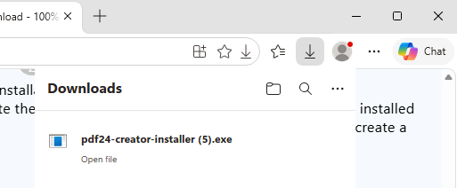

Acceptem la llicència i iniciem la instal·lació.

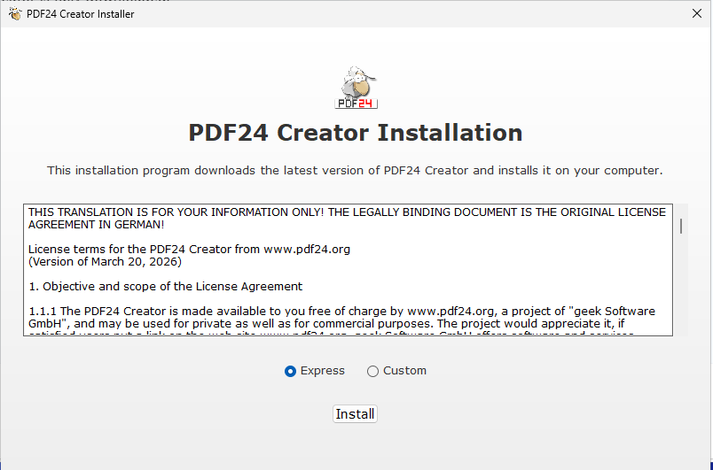

L'instal·lador descarrega els components necessaris.

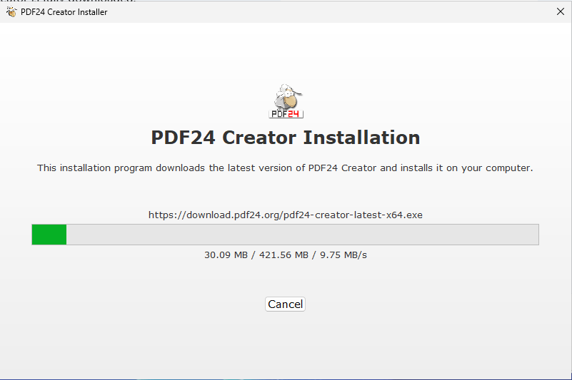

Un cop finalitzada, apareixerà l'aplicació **PDF24 Launcher** i les impressores per defecte.

### 1.2 Creació de les impressores corporatives

Obrim el **PDF24 Launcher** i anem a **Settings** (icona d'engranatge).

A la secció **PDF Printer**, premem el botó **+** per afegir una nova impressora.

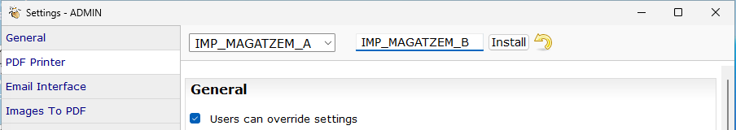

Creem les dues impressores amb els noms:
- `IMP_MAGATZEM_A`
- `IMP_MAGATZEM_B`

### 1.3 Configuració de les carpetes de sortida automàtica

Per simular la impressió i poder verificar el balanceig, configurem que cada impressora desi els PDFs en carpetes separades.

**Per IMP_MAGATZEM_A**:
- Output Directory: `C:\SortidaA`

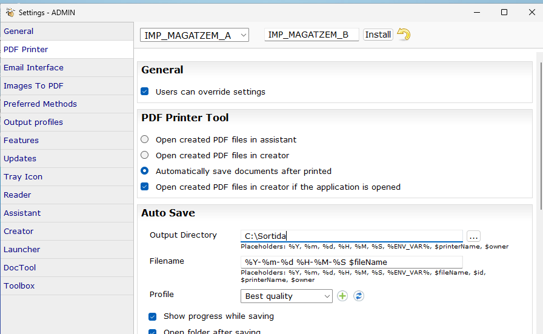

**Per IMP_MAGATZEM_B**:
- Output Directory: `C:\SortidaB`

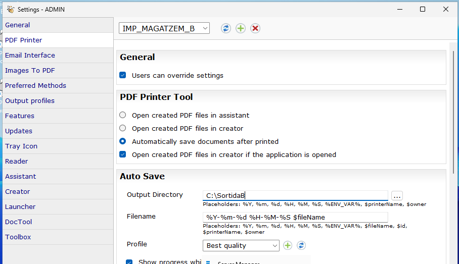

Un cop creades, verifiquem que apareguin a **Dispositius i impressores**.

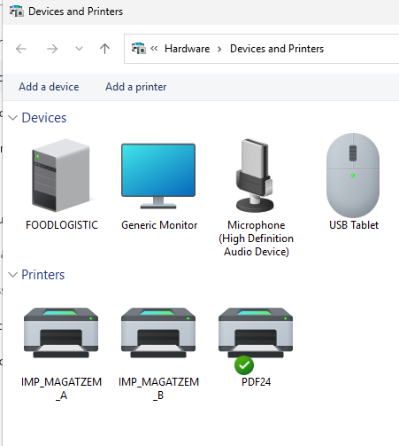

Al sistema de fitxers, es creen les carpetes `SortidaA` i `SortidaB`.

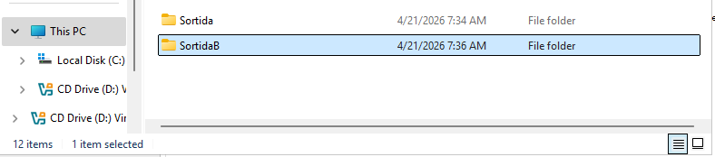


---

## Fase 2: Instal·lació del rol i configuració del Pool

### 2.1 Instal·lació del rol "Print and Document Services"

Obrim el **Server Manager** i seleccionem **Add Roles and Features**.

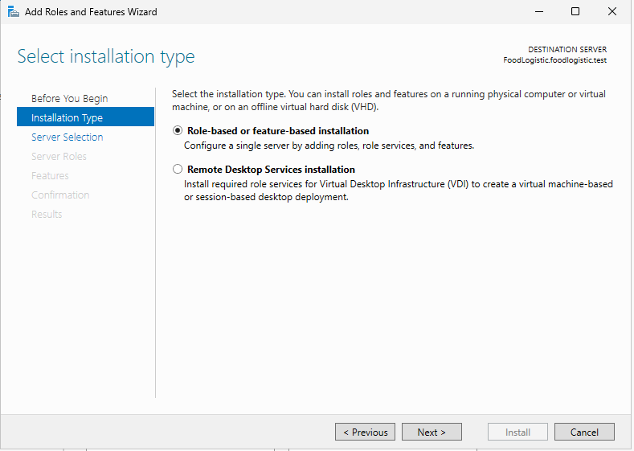

Triem **Role-based or feature-based installation**.

Seleccionem el servidor destí (en el nostre cas, `FoodLogistic.foodlogistic.test` amb IP `10.0.2.19`).

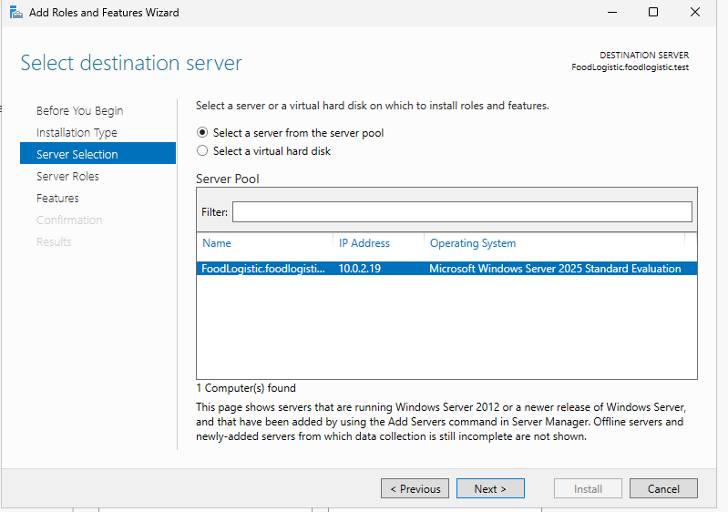

En la llista de rols, marquem **Print and Document Services**. S'afegeixen automàticament les eines d'administració.

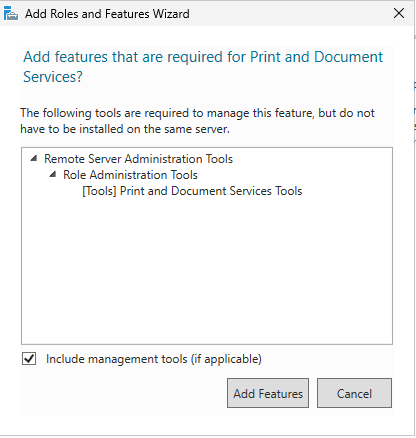

Dins dels serveis de rol, seleccionem només **Print Server** (és suficient per a les nostres necessitats).

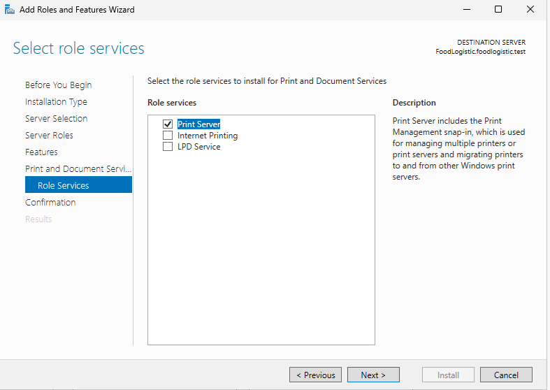

Finalitzem la instal·lació.

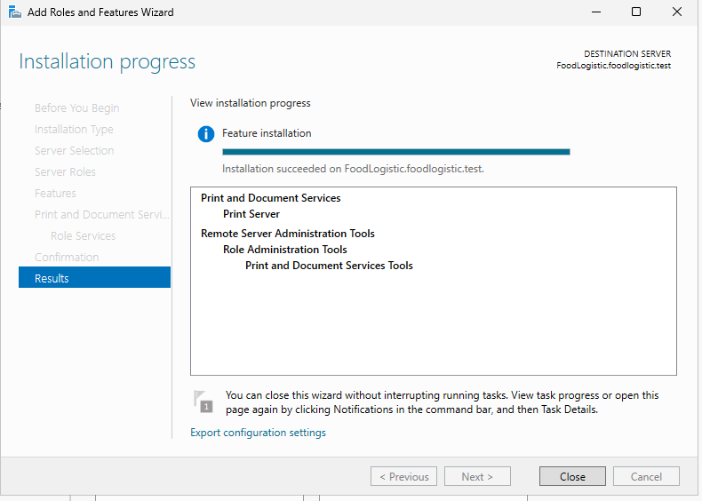

### 2.2 Accés a la consola Print Management

Des del **Server Manager**, anem a **Tools → Print Management**.

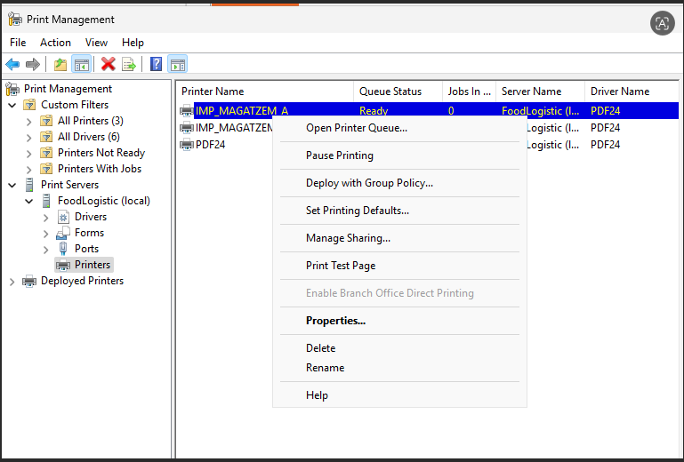

Aquí veiem els servidors d'impressió, controladors, ports i impressores.

### 2.3 Configuració del Printer Pooling

A **Print Management**, despleguem **Print Servers → FoodLogistic (local) → Printers**. Trobem les impressores `IMP_MAGATZEM_A` i `IMP_MAGATZEM_B`.

Fem clic dret sobre `IMP_MAGATZEM_A` i seleccionem **Properties**.

Anem a la pestanya **Ports**. Marquem la casella **Enable printer pooling** i seleccionem **ambdós ports** (el de A i el de B).

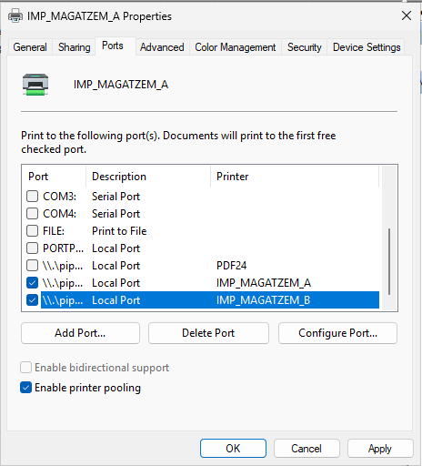


### 2.4 Compartir la impressora en xarxa

A la mateixa finestra de propietats, anem a la pestanya **Sharing**. Marquem **Share this printer** i mantenim el nom compartit `IMP_MAGATZEM_A`. Activem **Render print jobs on client computers** per reduir la càrrega del servidor.

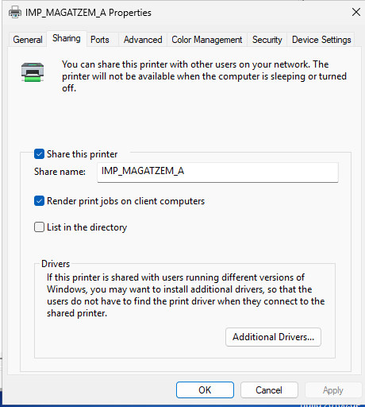

---

## Fase 3: Desplegament automatitzat mitjançant GPO

L'empresa no vol que els mossos de magatzem hagin d'instal·lar manualment la impressora. Per tant, utilitzarem una **GPO** per desplegar-la automàticament.

### 3.1 Creació de la GPO

Obrim **Group Policy Management** des del Server Manager (Tools → Group Policy Management).

Naveguem fins a la Unitat Organitzativa (OU) on es troben els usuaris o equips del magatzem (en el nostre cas, la OU `Usuaris`). Fem clic dret i seleccionem **Create a GPO in this domain and Link it here...**.

Anomenem la GPO: `GPO_Impressores_Magatzem`.

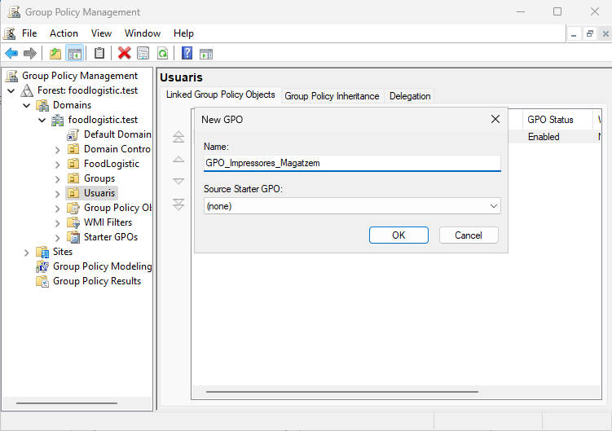

### 3.2 Desplegar la impressora amb "Deploy with Group Policy"

A **Print Management**, fem clic dret sobre `IMP_MAGATZEM_A` i seleccionem **Deploy with Group Policy**.

A la finestra, fem clic a **Browse** i seleccionem la GPO `GPO_Impressores_Magatzem`.

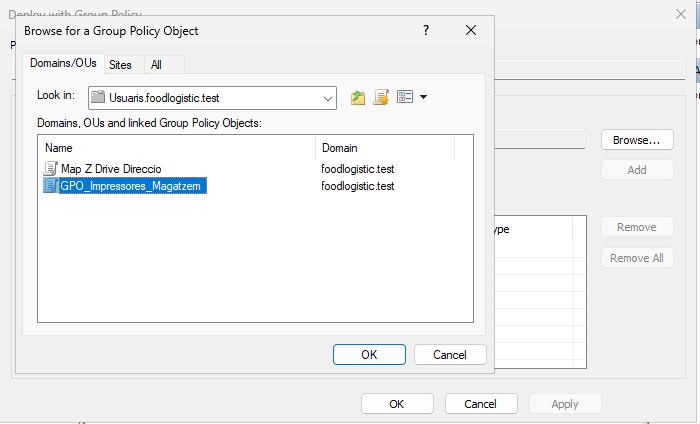

Despleguem la impressora a **The computers that this GPO applies to (per machine)**, així la impressora s'instal·larà a l'ordinador independentment de l'usuari que iniciï sessió (ideal per a entorns compartits de magatzem).

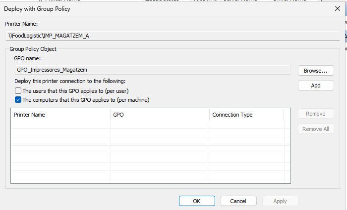

Confirmem que l'operació s'ha realitzat correctament.

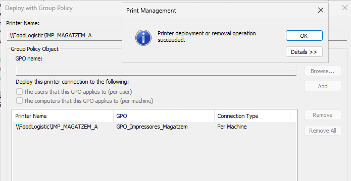

### 3.3 Actualització de polítiques al client

Al client Windows 11 (unit al domini), obrim **PowerShell** com a administrador i executem:

```powershell
gpupdate /force
```

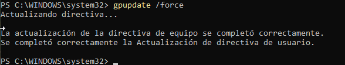

### 3.4 Comprovació al client

Des del client, comprovem que la impressora apareix automàticament. Podem obrir **Run** (`Win + R`) i escriure `\\FoodLogistic\IMP_MAGATZEM_A`.

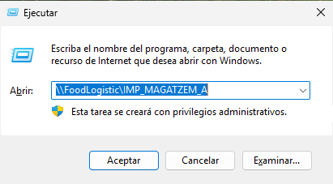

El sistema ens demana confirmació per instal·lar el controlador. Confiem i instal·lem.

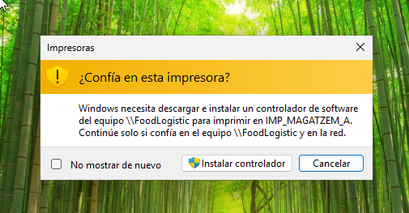

Un cop instal·lada, apareix a **Configuració → Bluetooth i dispositius → Impressores i escàners**.

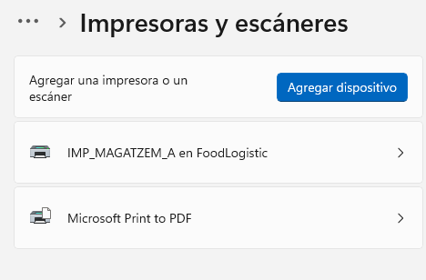


---

## Fase 4: Proves de càrrega i seguretat

### 4.1 Simulació del balanceig (printer pooling)

Des del client, obrim el **Bloc de notes** i escrivim un text de prova.

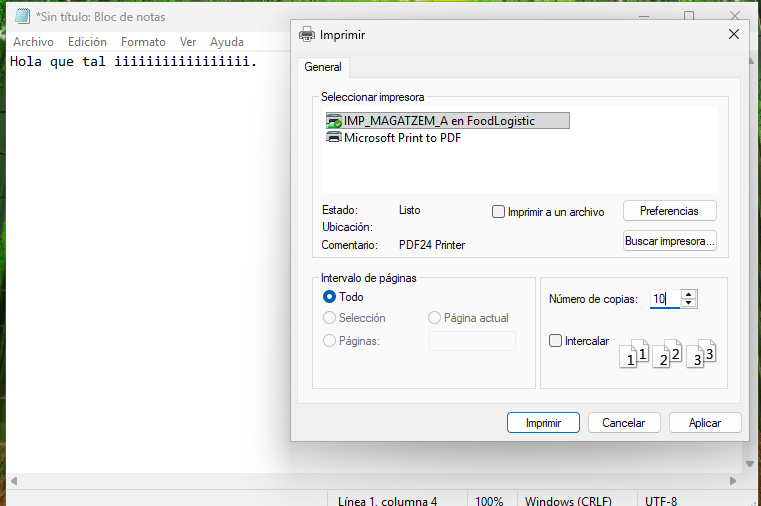

Imprimim **10 documents seguits** a la impressora `IMP_MAGATZEM_A`. A la finestra d'impressió, establim **10 còpies** (o repetim 10 vegades).


Un cop enviats, anem al servidor i comprovem les carpetes `C:\SortidaA` i `C:\SortidaB`.

**Resultat a SortidaA**:

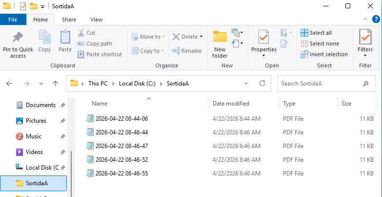

**Resultat a SortidaB**:

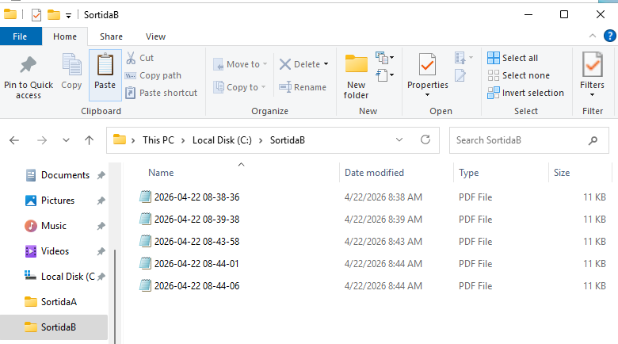

Observem que els fitxers PDF es distribueixen aleatòriament entre les dues carpetes, demostrant que el **printer pooling** balanceja la càrrega correctament.


### 4.2 Restricció horària (Available Times)

L'empresa vol que la impressora només funcioni en horari laboral (de 06:00 a 22:00). Ho configurem des del servidor.

A **Print Management**, obrim les propietats de `IMP_MAGATZEM_A` i anem a la pestanya **Advanced**.

Marquem **Available from** i establim:
- **From:** 6:00 AM
- **To:** 10:00 PM

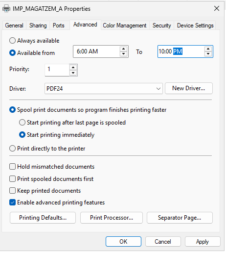

Apliquem els canvis.

**Prova de la restricció**: Fora d'aquest horari (per exemple, canviant temporalment el rellotge del servidor a les 23:00), els treballs d'impressió queden en cua i no es processen fins que torna a ser hora laboral.

### 4.3 (Opcional) Restricció per grup de seguretat

L'activitat també demana instal·lar una nova impressora i restringir la impressió a un grup del domini. Creem `IMP_RESTRINGIDA`.

#### 4.3.1 Creació de la impressora restringida

Des del PDF24 Launcher, afegim una nova impressora anomenada `IMP_RESTRINGIDA` i la configurem amb sortida a `C:\SORTIDA_RESTRINGIDA`.

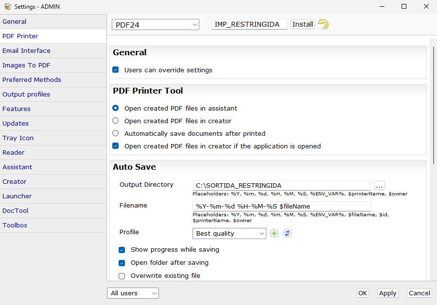

#### 4.3.2 Creació del grup de seguretat al domini

Obrim **Active Directory Users and Computers**. Dins la OU `Groups` (o la que correspongui), creem un nou grup:

- **Group name:** `Grup_Impressio_Especial`
- **Group scope:** Global
- **Group type:** Security

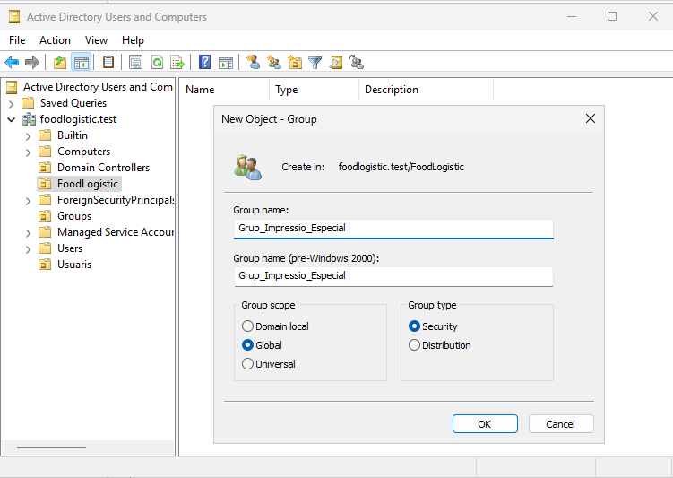

#### 4.3.3 Assignació de permisos a la impressora

Anem a **Print Management**, propietats de `IMP_RESTRINGIDA`, pestanya **Security**.

Eliminem el grup **Everyone** (o qualsevol que doni accés general). Afegim el grup `Grup_Impressio_Especial` i li atorguem el permís **Print** (Allow).

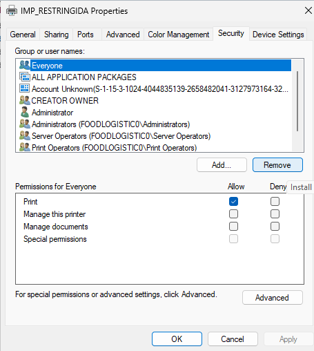

#### 4.3.4 Afegir usuaris al grup

A **Active Directory Users and Computers**, editem les propietats d'un usuari (per exemple, `u_xofer`) i l'afegim al grup `Grup_Impressio_Especial` a la pestanya **Member Of**.

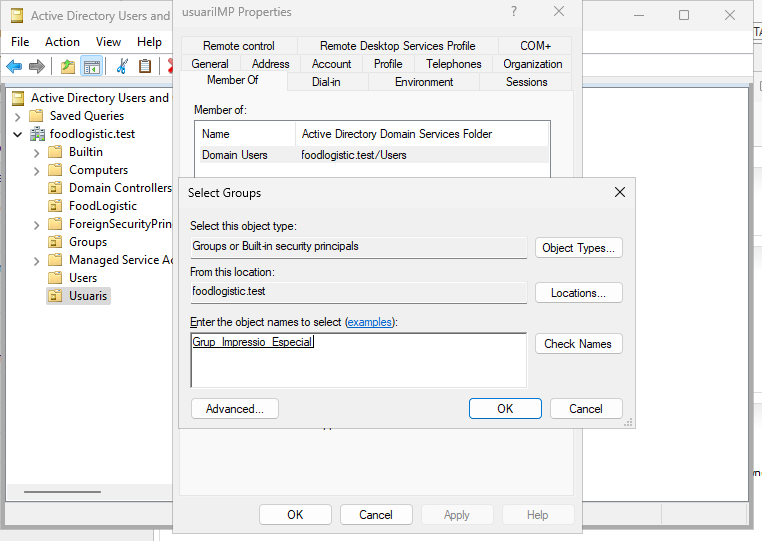

#### 4.3.5 Prova de restricció

Iniciem sessió al client amb un usuari **que no sigui membre del grup** (per exemple, `usuariIMP`).

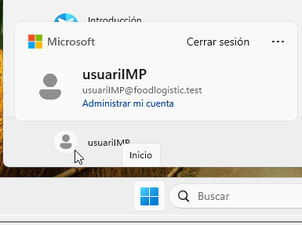

Intentem accedir a `\\FoodLogistic\IMP_RESTRINGIDA`. Ens donarà error de connexió o permisos.

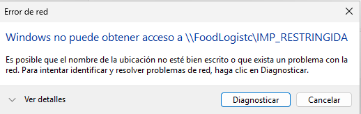

En canvi, si iniciem sessió amb `u_xofer` (membre del grup), podrem instal·lar i utilitzar la impressora sense problemes.

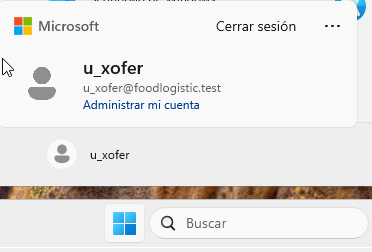

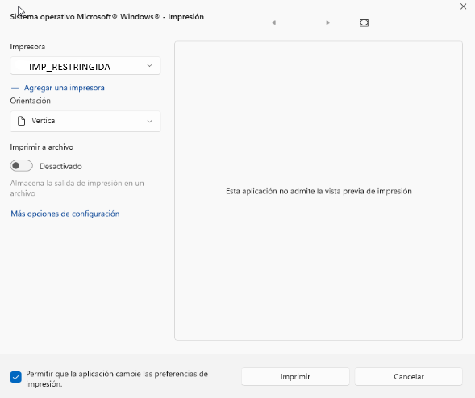


---

## Resum de configuracions realitzades

| Fase | Tasca | Verificació |
|------|-------|--------------|
| 1 | Instal·lació PDF24 i creació d'IMP_MAGATZEM_A i IMP_MAGATZEM_B | Impressores visibles a Print Management |
| 1 | Configuració carpetes SortidaA i SortidaB | Les carpetes existeixen |
| 2 | Instal·lació rol Print and Document Services | Rol apareix a Server Manager |
| 2 | Printer pooling (ports A i B marcats) | A la pestanya Ports, pooling activat amb dos ports |
| 2 | Compartir impressora | Nom compartit = IMP_MAGATZEM_A |
| 3 | Creació GPO GPO_Impressores_Magatzem | GPO visible a Group Policy Management |
| 3 | Deploy with Group Policy (per machine) | Entrada a Deployed Printers |
| 3 | `gpupdate /force` al client | Execució correcta |
| 4 | Enviar 10 documents | Distribució entre SortidaA i SortidaB |
| 4 | Restricció horària 6:00-22:00 | Fora d'horari els treballs queden en cua |
| 4 | Creació d'IMP_RESTRINGIDA i grup | Només membres del grup hi poden imprimir |


